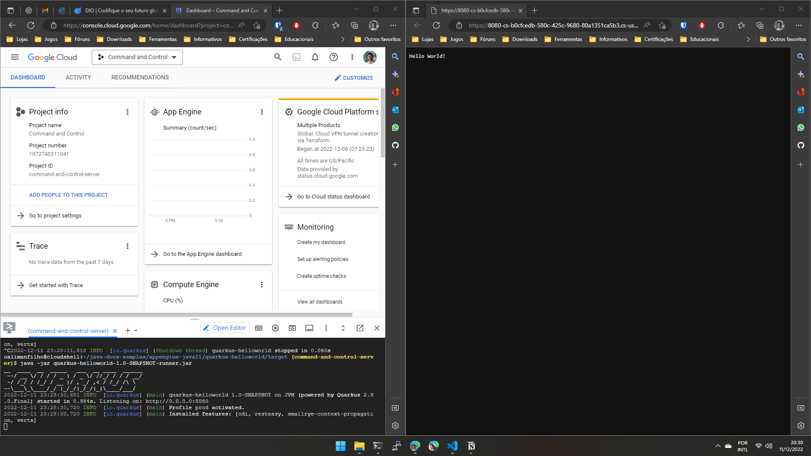

# Utilizando o _Cloud Shell_

Repositório contento o passo a passo para a execução da aplicação `quarkus-helloworld` e a imagem da aplicação em execução.

1. Ativar o _Cloud Shell_.

2. Realizar o clone do repositório [java-docs-example](https://github.com/GoogleCloudPlatform/java-docs-samples) do GoogleCloudPlatform na `HOME` do usuário.

    ```bash
    git clone https://github.com/GoogleCloudPlatform/java-docs-samples.git
    ```

3. Acessar a pasta da aplicação em `~/java-docs-samples/appengine-java11/quarkus-helloworld/`.

4. Solicitar ao `Maven` que compile, teste e converta o código-fonte Java do projeto em um programa Java executável (`.jar` ou `.war`).

    ```bash
    mvn clean install
    ```

5. Executar o artefato (`quarkus-helloworld-1.0-SNAPSHOT-runner.jar`) gerado com o comando anterior, localizado em `~/java-docs-samples/appengine-java11/quarkus-helloworld/target/`.

    ```bash
    cd target
    java -jar quarkus-helloworld-1.0-SNAPSHOT-runner.jar
    ```

6. Após o comando a aplicação ficará em execução no _link_ `http://0.0.0.0:8080`, onde mostrará a mensagem `Hello World!`.

    