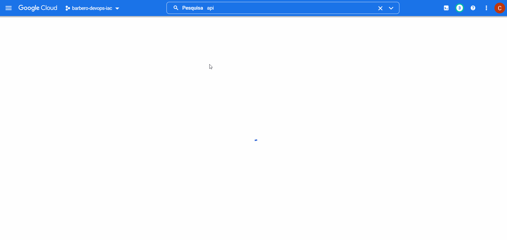
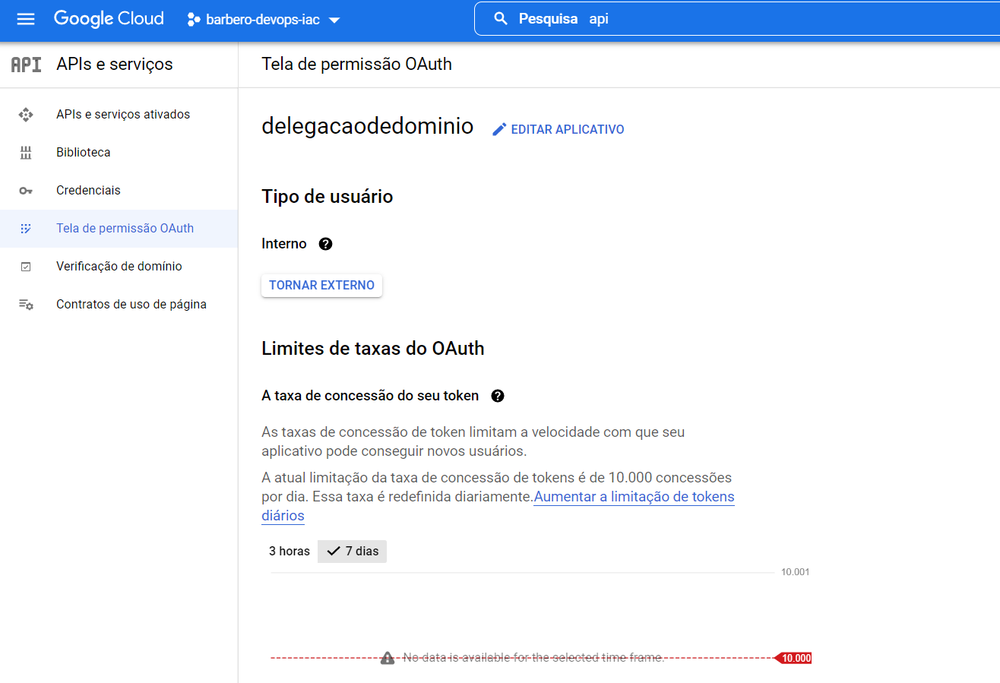
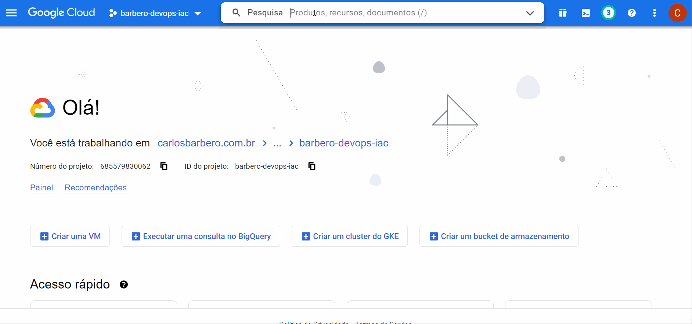
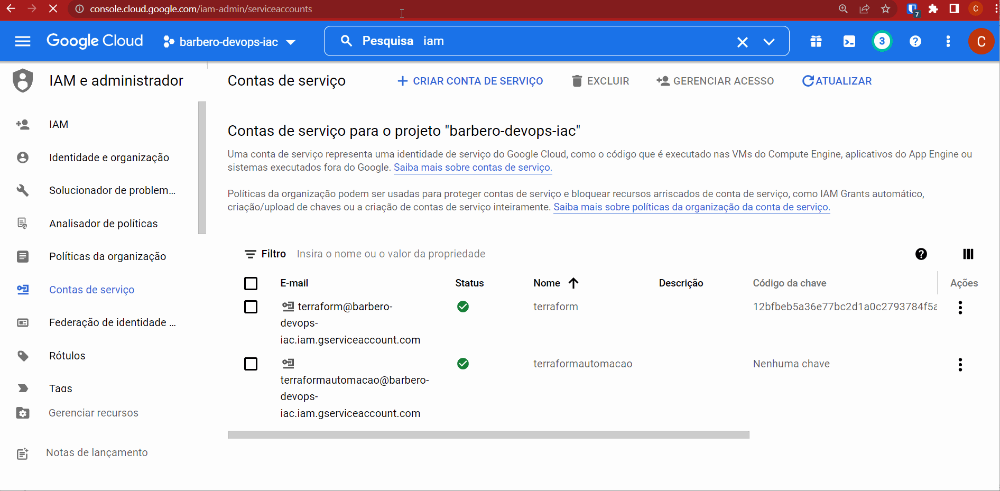
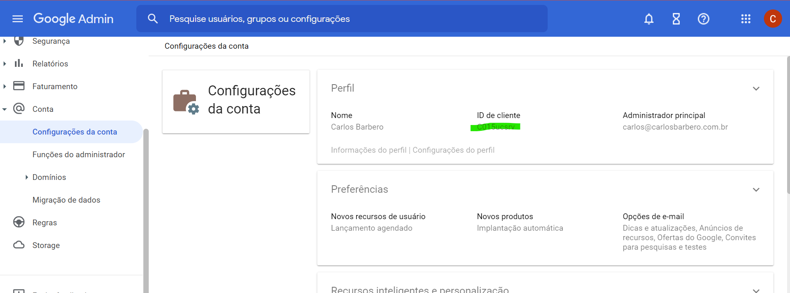
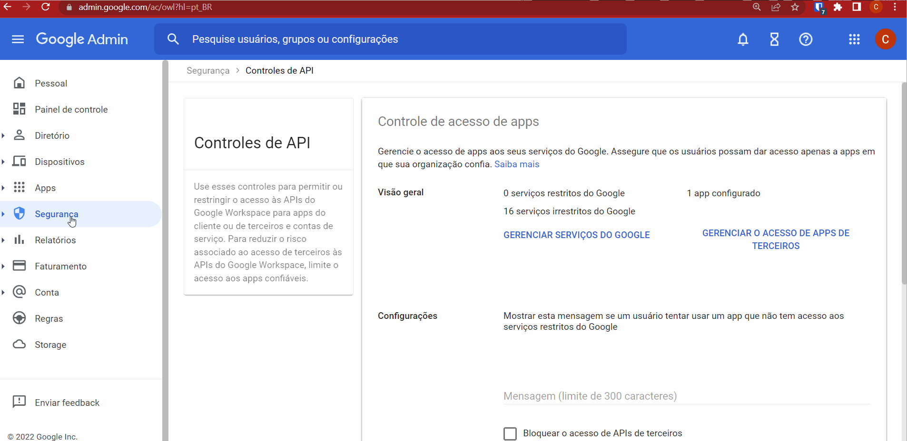

# Implementação de Terraform para Admin Console do Google Workspace

Neste projeto, será implementado o Admin Console do Google Workspace através do processo automatizado do Terraform.

* O `Admin SDK` deve estar habilitado no projeto.

    https://console.cloud.google.com/apis/library/admin.googleapis.com

    

* A Tela de Consentimento do Google deve está configurada para o projeto.

    https://console.cloud.google.com/apis/credentials/consent

    

* Deve ser criado a `Service Account` para que o Terraform consiga se autenticar e criar os recursos.

    https://console.cloud.google.com/iam-admin/serviceaccounts

    

* A chave JSON da `Service Account` deve ser criada.

    https://console.cloud.google.com/iam-admin/serviceaccounts

    

* A chave JSON da `Service Account` deve ser inserida no projeto.

* As seguintes alterações devem ser feitas no arquivo main.tf.

    1. Em `customer_id` deve ser informado o `Customer ID` do painel do Google Workspace.

        https://admin.google.com/ac/accountsettings

        Abaixo segue a imagem onde pode ser visualizado o `Customer ID`.

        

    2. Na opção `credentials` deve ser informado o nome do arquivo com a chave JSON gerada da `Service Account`.

    3. Na opção `impersonated_user_email` deve ser informado o email do usuário administrador do `Cloud Identity` ou `Admin Console`.

* A `Service Account` deve ser adicionada como _domain delegate_ no painel do `Admin Console`.

    https://admin.google.com/ac/owl

    

    As informações de `Client ID` encontram-se na chave JSON da `Service Account`.

    Será necessário informar os escopos de acesso as APIs do Admin SDK.

    Para criação de usuários e grupos os escopos necessários são:

    ```
    "https://www.googleapis.com/auth/admin.directory.user",
    "https://www.googleapis.com/auth/admin.directory.userschema",
    "https://www.googleapis.com/auth/admin.directory.group"
    ```

* Após as configurações serem feitas, o Terraform irá criar os recursos no Google Workspace através de processos automatizados. Para testar, os seguinte códigos devem ser executados:
    ```bash
    terraform plan
    terraform apply
    terraform destroy
    ```